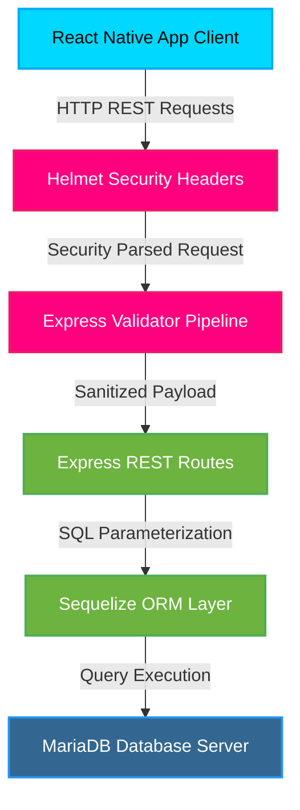

# DeliverUS RESTful API - Backend Portfolio & Interactive Simulator

> [!IMPORTANT]
> **Academic Integrity Notice:** The core source code of this project belongs to an academic course (*Introducción a la Ingeniería del Software y Sistemas de Información II* at *University of Sevilla, ETSII*). To prevent plagiarism and comply with university regulations, the repository remains private. This public repository serves as a **professional portfolio and interactive live simulator** to demonstrate the project's backend logic, validation rules, schemas, and security standards.

## 🔗 Live Showcase & Interactive Simulator
🚀 **[Click here to open the Live Interactive Showcase Web App](https://SantiiDG.github.io/deliverus-showcase/)**

---

## 📋 Overview

**DeliverUS** is a multi-tenant food delivery backend platform designed to manage food orders from local restaurants to customers. The project focuses on publishing clean RESTful services, implementing strict business logic rules, modeling databases with Sequelize ORM, and implementing essential security filters against web vulnerabilities.

This showcase details the full lifecycle of the project, including its software architecture, database design, Docker container configuration, and validation pipelines.

---

## 👤 Santiago Diestro Gallego - Core Contributions

In this team project, I acted as the **Backend & Security Lead**, contributing directly to the following areas:

*   **Order Lifecycle Controllers:** Programmed Express backend controllers to manage order status transitions (`pending`, `in process`, `sent`, `delivered`) and calculate shipping costs dynamically.
*   **ORM Database Architecture:** Configured Sequelize models mapping relationship layers among users, restaurants, products, and order entities.
*   **Security Validation Pipelines:** Integrated data sanitization, SQL Injection shields via Sequelize parametrized statements, and HTTP security headers via the `helmet` package.
*   **Database Migrations & Seeders:** Authored custom MariaDB table migration scripts and seeders to populate initial system categories and mock users.

---

## 🛠️ Technology Stack

| Component | Technology | Role |
| :--- | :--- | :--- |
| **Runtime** | Node.js | Fast, non-blocking asynchronous execution |
| **Framework** | Express.js | Route mapping and REST API endpoint server |
| **ORM Layer** | Sequelize ORM | Schema management, SQL sanitization, and migrations |
| **Database** | MariaDB / MySQL | Secure relational database engine |
| **Security** | Helmet.js, Express-Validator | HTTP headers configuration and payload validation |
| **DevOps** | Docker, Docker Compose | Containerized local environment and database setups |
| **QA** | ESLint | Code syntax standard checking |

---

## 📐 System Architecture

---

## ⚙️ Core Business Rules

*   **BR1 (Free Shipping):** If an order's total price is greater than `10.00€`, the shipping cost is automatically set to `0.00€` (free shipping). Otherwise, a delivery fee is applied.
*   **BR2 (Single Restaurant):** An order can only include products from one restaurant at a time. Multi-restaurant carts are blocked at the validator level.
*   **BR3 (Immutable Orders):** Once an order is confirmed, it is initialized as `pending` and cannot be modified.

---

## 📁 Repository Contents

*   `index.html` - Interactive landing page and browser simulator.
*   `style.css` - Custom premium styling sheet for the dashboard layout.
*   `app.js` - Client-side state manager and simulator logic.
*   `README.md` - Professional portfolio introduction.

---

## 📧 Contact Information

For any inquiries regarding this project or potential employment opportunities, please feel free to reach out:

*   **Developer:** Santiago Diestro Gallego
*   **Email:** [santi18diestro@gmail.com](mailto:santi18diestro@gmail.com)
*   **LinkedIn:** [Santiago Diestro Gallego](https://www.linkedin.com/in/santiago-diestro-b6428116a/)
